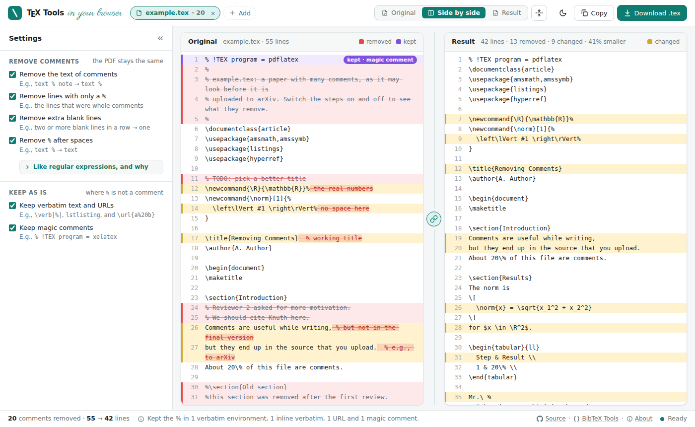

# TeX Tools

Tools for working with LaTeX files, in your browser.

## Web App
The web app shows your file next to the result with the current settings,
before you download it: open, drop, or paste (Ctrl+V) your `.tex` files, or a `.zip` or `.tar.gz` of your project.  It
runs Python in your browser with [Pyodide](https://pyodide.org), so your
files never leave your computer.



* Removed lines are marked red, and the removed end of a changed line is
  struck through.  Text that is kept on purpose, e.g., a `%` in a `verbatim`
  environment, is marked purple.
* Click the fold button between the panes to fold the unchanged lines, so
  that you see only what changed, with two lines around each change.  Click
  a fold to show its lines.
* Open the `.zip` of your project, e.g., from Overleaf, or the source of a
  paper from arXiv (a `.tar.gz`), and download it in the same format with
  the comments removed from all its `.tex` files.  The other files, e.g.,
  figures and the `.bib` file, and the folders stay as they are.  To keep
  the comments of a `.tex` file, choose it and check _Exclude_.  The source
  of a paper with a single file on arXiv is a gzipped `.tex` file, which is
  opened like a `.tex` file.
* Several files can be open at once, e.g., all the files of a paper.  Choose
  the shown file above the original, and download it, or all of them as a
  `.zip`.  Files keep their names, so that `\input` and `\include` still
  find them.
* Files that are not UTF-8 are read and saved as Latin-1, and line endings
  (`\n` or `\r\n`) are kept.

To run the web app locally, build it and serve it on http://localhost:8000
with
```bash
python3 web/build.py --serve
```
The build downloads Pyodide from npm once and caches it in
`~/.cache/textools-web`.  The workflow `.github/workflows/web.yml` publishes
the web app with GitHub Pages for every push to `main`.  In the settings of
the repository, select _GitHub Actions_ as the source under _Pages_ once.

## Remove Comments
Removes the comments of LaTeX files, e.g., before you upload them to arXiv,
where everybody can read them, without changing the typeset document.  The
steps follow the workflow with regular expressions:

| Step | Like replacing | with |
|------|----------------|------|
| 1. Empty comments | `(?<!\\)%.*` | `%` |
| 2. Remove comment lines | `\n *% *\n` | `\n` |
| 3. Remove extra blank lines | `\n *\n *\n` | `\n\n` |
| 4. Remove `%` after spaces | `[ \t]+%.*$` | nothing |

Step 1 keeps the `%`, since it also removes the line break after it, e.g., at
the end of a line in a macro definition.  Step 4 removes it after spaces,
since the spaces end the word like the line break does.

Unlike the regular expressions, the steps work on the comments as LaTeX reads
them:
* A `%` after `\\` (a line break) is a comment, `\%` is not.
* Several comment lines in a row are all removed, also on the first line and
  when they are indented with tabs.
* Step 4 only removes a `%` after text on the same line.  It never leaves an
  empty line, which would end the paragraph, or be an error in display math
  like `\[ ... \]`.  It keeps the spaces after a control space `\ `.
* Verbatim text is kept as it is: the environments `verbatim`, `Verbatim`,
  `lstlisting`, `minted`, `alltt`, and `filecontents`, and `\verb`,
  `\lstinline`, `\mintinline`, `\url`, and `\href`, e.g.,
  `\url{https://example.org/a%20b}`.  So are magic comments like
  `% !TEX program = xelatex`.

In Python:
```python
from textools import Options, remove_comments

result = remove_comments(text)
print(result.text)
# only steps 1 and 2
result = remove_comments(text, Options(blank_lines=False, space_before=False))
```

## Tests
```bash
pip install -e ".[test]"
pytest
```
